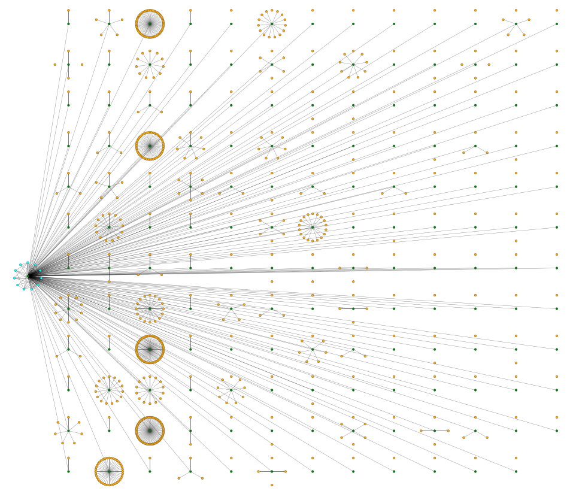
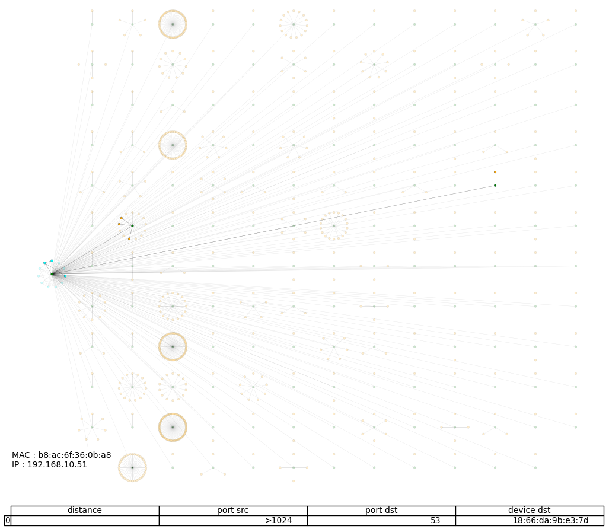

# Drawing graphs from .pcap files

## Overview

This project aims to automatize the drawing of interactive graphs from `.pcap` files. It is all written in python. It creates images where green nodes are the routers, cyan nodes are the devices in the local network and orange ones are the ones beyond the router of the local network. It shows info about the node when hovering and shows all the devices that communicated with the selected one when clicking. The info shown are the MAC adress, the IP adress and info about the ports used. These info only concern ports below 1024 and packets that left the selected device. It contains the source port, the destination port and the destination device. You can see an example below.





For now on, the project only works with one .pcap file from one source of capture but the goal is to be able to draw graph from multiple capture files. When it will be possible, it will be interesting to watch for the ttl of files that go from a network to the other, to estimate the distance between the networks.

## Usage

> :warning: This project only works with IPv4 addresses. If you used IPv6 during the capture, it may not work.

Three files of the repository are buid to be executed :

1. [from_pcap_to_json.py](from_pcap_to_json.py)

This file takes a `.pcap` file, isolates interesting data and stores it in a `.json` file. To run it, you must open a command prompt and go to the repository where the file is stored and run :

```sh
python3 from_pcap_to_json.py file_name
```

where `file_name` is the name of the `.pcap` file.

2. [main.py](main.py)

This file takes a `.json` file obtained with [from_pcap_to_json.py](from_pcap_to_json.py), plots an interactive graph figure and saves its data in a `.pckl` file. To run it, you must open a command prompt and go to the repository where the file is stored and run :

```sh
python3 main.py file_name.json save_file_name
```

where `file_name` is the name of the `.json` file and save_file_name is the name of the file where data are saved

3. [reload_image.py](reload_image.py)
   
This file takes a `.pckl` file obtained with [main.py](main.py) and plots the graph without recalculating all the data. To run it, you must open a command prompt and go to the repository where the file is stored and run :

```sh
python3 reload_image.py file_name
```

where `file_name` is the name of the file where data were saved

